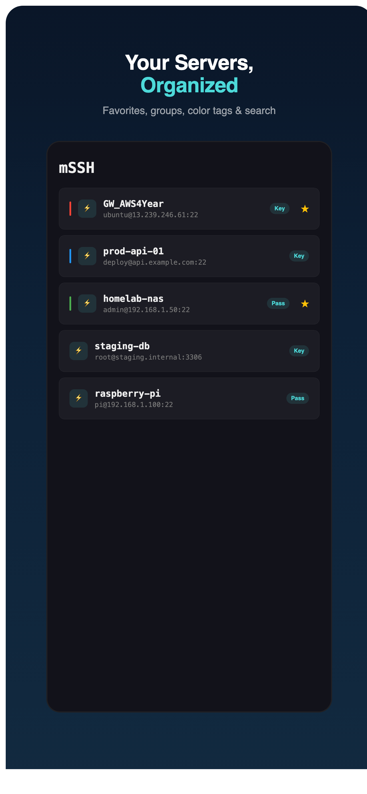
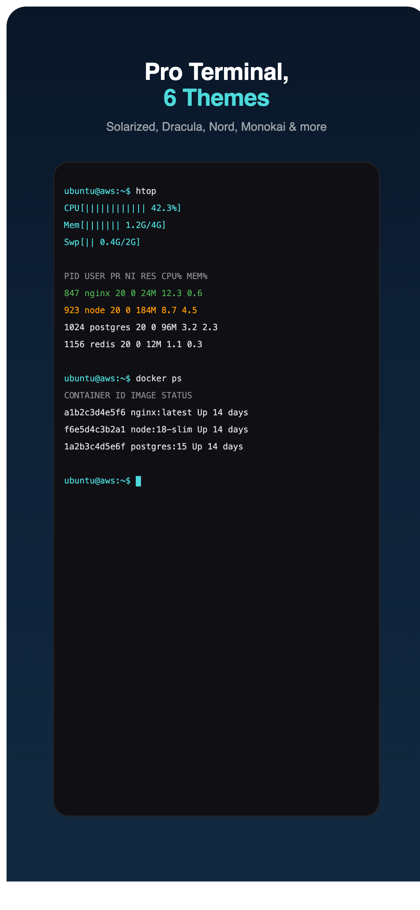
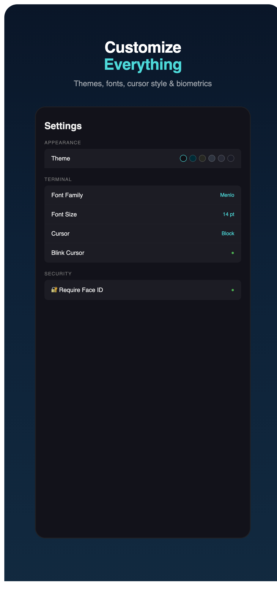
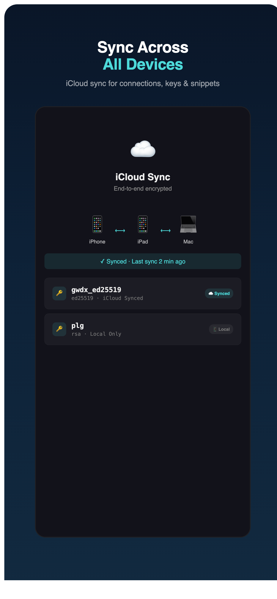
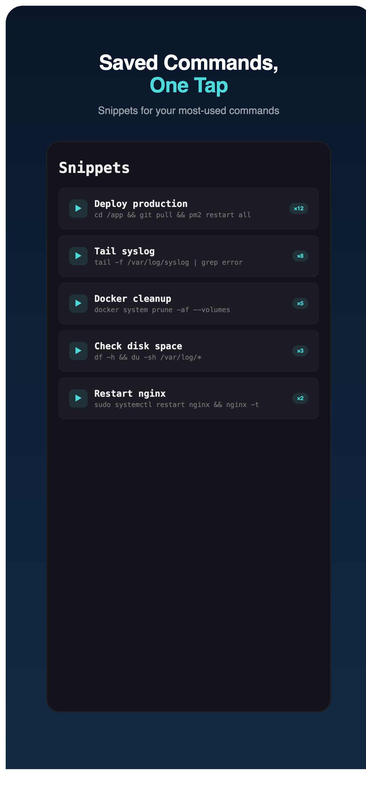

<p align="center">
  
  
  
  
</p>

<h1 align="center">mSSH</h1>
<p align="center"><strong>Professional SSH & SFTP client for iPhone, iPad, and Mac</strong></p>
<p align="center">Open source. No ads. No telemetry. Just SSH.</p>

<p align="center">
  <a href="https://apps.apple.com/app/mssh/id6745428607">
    
  </a>
</p>

---

## Features

### Terminal
- Full **xterm-256color** terminal emulation via [SwiftTerm](https://github.com/migueldeicaza/SwiftTerm)
- **6 built-in themes**: Default, Solarized Dark, Monokai, Nord, Dracula, Tokyo Night
- Customizable **font family, size (9–24pt), cursor style** (block/bar/underline), and blink
- **Split terminal** view on iPad
- Custom iOS **keyboard accessory bar** with Esc, Tab, Ctrl, arrows, and snippets

### Connections
- **Favorites**, **groups**, and **color tags** for organizing servers
- **Search** across all connections by name, host, user, or group
- **Quick Connect** bar — type `user@host:port` and go
- **SSH Config import** — paste your `~/.ssh/config` and all hosts appear
- Swipe actions for quick edit/delete

### Keys & Authentication
- **Ed25519, ECDSA, RSA** (OpenSSH format) key support
- **Generate Ed25519** keys directly in the app
- Import keys by pasting PEM text or from Mac's `~/.ssh/` folder
- **Face ID / Touch ID** biometric lock
- Host key **TOFU** (Trust On First Use) with SHA-256 fingerprints

### Cross-Device Sync
- **iPhone ↔ iPad**: Automatic via iCloud (CloudKit)
- **iPhone/iPad → Mac**: Push/Pull via iCloud key-value store
- **Private SSH keys**: Optional per-key iCloud Keychain sync (E2E encrypted)
- **Passwords**: iCloud Keychain sync
- **Mac `~/.ssh` auto-import**: First launch scans your existing keys + config

### SFTP
- Browse remote filesystems
- Upload, download, delete files
- Intuitive touch interface

### Snippets
- Save frequently-used commands
- One-tap send to any active session
- Access from terminal toolbar or keyboard accessory bar
- Usage stats track your most-used snippets

### Port Forwarding (Preview)
- Configure local port-forwarding rules per connection
- Rules persist and are ready for when Citadel adds direct-tcpip support

### Tip Jar
- Support development with optional tips (Coffee $0.99 / Lunch $4.99 / Dinner $9.99)
- No features are locked behind payment — everything is free

---

## Screenshots

<p align="center">
  
  
  
  
  
</p>

---

## Tech Stack

| Component | Library |
|---|---|
| SSH2 Protocol | [Citadel](https://github.com/orlandos-nl/Citadel) (NIO-based) |
| Terminal Emulation | [SwiftTerm](https://github.com/migueldeicaza/SwiftTerm) |
| UI Framework | SwiftUI + UIKit (terminal bridge) |
| Data Persistence | SwiftData + CloudKit |
| Key Storage | iOS/macOS Keychain (hardware-encrypted) |
| Cross-device Sync | CloudKit + NSUbiquitousKeyValueStore + iCloud Keychain |

## Building

Requires **Xcode 16+**, **iOS 18.0+** / **macOS 15.0+**, and [xcodegen](https://github.com/yonaskolb/XcodeGen).

```bash
# Install xcodegen
brew install xcodegen

# Clone
git clone https://github.com/nirasnet/mssh.git
cd mssh

# Generate Xcode project + build
xcodegen generate
xcodebuild build -project mssh.xcodeproj -scheme mssh \
  -sdk iphonesimulator -destination 'platform=iOS Simulator,name=iPhone 16 Pro Max' \
  CODE_SIGNING_ALLOWED=NO

# Or open in Xcode
open mssh.xcodeproj
```

For device builds, set your own `DEVELOPMENT_TEAM` in `project.yml`.

## Architecture

```
Views (SwiftUI) → ViewModels (@Observable) → Services (async) → Citadel/SwiftTerm
```

See [CLAUDE.md](CLAUDE.md) for detailed architecture documentation including the SSHTerminalBridge data flow, host key TOFU implementation, serialised write stream, and cross-device sync architecture.

## Privacy

- **No accounts required**
- **No telemetry or analytics**
- **No ads**
- All credentials stored in the **hardware-encrypted Keychain**
- iCloud sync is optional and uses Apple's **end-to-end encryption**
- Open source — audit the code yourself

## Contributing

Pull requests welcome. Please read [CLAUDE.md](CLAUDE.md) for architecture context before diving in.

## License

MIT License — see [LICENSE](LICENSE) for details.

## Support

- **Star this repo** if mSSH is useful to you
- **Tip jar** in Settings → Support mSSH (App Store version)
- **Report bugs** via [GitHub Issues](https://github.com/nirasnet/mssh/issues)

---

<p align="center">
  Built with ❤️ using <a href="https://github.com/migueldeicaza/SwiftTerm">SwiftTerm</a> and <a href="https://github.com/orlandos-nl/Citadel">Citadel</a>
</p>
